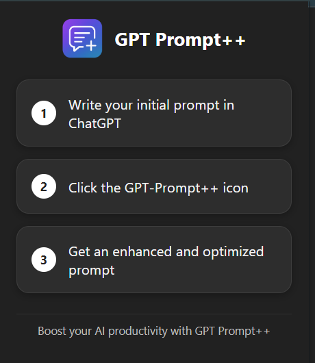
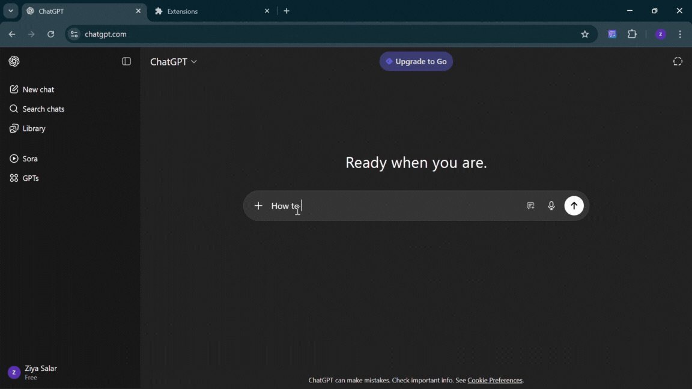

# # `` GPT Prompt++

 GPT Prompt++

**GPT Prompt++** is a lightweight browser extension backed by a **Spring Boot** service that supercharges your prompt engineering workflow. It was built to solve a real-life frustration—rewriting and tweaking prompts repeatedly while working with ChatGPT. GPT Prompt++ helps you **refine**, **optimize**, and **reuse** prompts seamlessly.

> **Status:** Extension will be live soon. This repo is actively evolving and open to contributions.

---

## ✨ Features

* 🔹 **Prompt Optimization** – Automatically enhances your prompts for higher‑quality outputs.
* 🔹 **Template Management** – Save, edit, and reuse prompt templates by scenario.
* 🔹 **One‑Click Insert** – Inject enhanced prompts straight into the ChatGPT editor.
* 🔹 **Clean UI** – Minimal, unobtrusive button inside the ChatGPT compose bar.
* 🔹 **Cross‑Platform (Planned)** – Support for multiple browsers and LLMs beyond ChatGPT.
* 🔹 **Open Source** – Community‑driven, extensible architecture.

---

## 🛠 Tech Stack

* **Backend:** [Spring Boot](https://spring.io/projects/spring-boot) (Java 21), REST API
* **Extension:** JavaScript, HTML, CSS (Manifest v3)
* **Build/Tooling:** Maven (backend)

---

## 📂 Repository Structure (suggested)

```
.
├── Chat-GPT-Extention/               # Browser extension source
│   ├── manifest.json
│   ├── content.js
│   ├── icons/
│   └── ...
├── gpt-prompt-plus-plus-sb/                 # Spring Boot application
│   ├── pom.xml
│   └── src/main/java/...
├── docs/                    # Screenshots, demo GIFs
└── README.md
```

---

## ⚙️ Local Installation

### 1) Clone the Repository

```bash
git clone https://github.com/ZiyaSalar/GPT_Prompt-plus-plus.git
cd gpt-prompt-plusplus
```

### 2) Backend Setup (Spring Boot)

**Requirements:** Java 21, Maven

```bash
cd backend
mvn spring-boot:run
```

The server starts on `http://localhost:8080`.

**Default endpoint used by the extension**

```
POST /api/gptprompt/generate
Body: { "promptContent": "<string>" }
Response: plain/text  (enhanced prompt)
```

To customize the port or path, edit `application.properties`:

```properties
server.port=8080
# other properties...
```

### 3) Load the Extension (Chrome/Edge)

1. Navigate to `chrome://extensions/`.
2. Enable **Developer mode** (top-right).
3. Click **Load unpacked** and select the `extension` folder.
4. Open ChatGPT and look for the **GPT Prompt++** button in the compose bar.

*(Firefox support is planned; manifest and APIs will be adapted.)*

---

## 🚀 Usage

1. Open **ChatGPT** in your browser.
2. Type your initial prompt as usual.
3. Click the **GPT Prompt++** button to enhance/optimize.
4. The refined prompt is automatically inserted into the ChatGPT editor.

---

## 🔒 Permissions (Extension)

Minimal permissions are used:

* `activeTab` – to interact with the current ChatGPT tab.
* `scripting` – to inject the UI button and handle editor interactions.
* Optional: `storage` – for saving reusable templates locally.

Review `manifest.json` for the exact list.

---

## 🧪 Testing Checklist

* Backend is running locally (`/api/gptprompt/generate`).
* Button appears inside ChatGPT compose bar.
* Clicking the button calls the backend and inserts the enhanced prompt.
* Network calls return HTTP 200 with expected text.

---

## 🧰 Troubleshooting

**Button not visible?**

* ChatGPT DOM updates frequently. Ensure your selector targets a stable container (e.g., the compose bar controls).
* Try a resilient query (example):

  * `document.querySelector(".ms-auto.flex.items-center.gap-1\\.5")`
  * or derive from `form textarea` → find the nearest controls div.
* Temporarily give the button a visible background to confirm insertion.

**CORS / Network errors?**

* If calling `http://localhost:8080` from the extension, ensure the backend enables CORS:

```java
@CrossOrigin(origins = "*")
```

* Confirm `Content-Type: application/json` and correct JSON body.

**Image not loading in button?**

* Verify icon paths in `manifest.json` and `chrome.runtime.getURL("icons/...png")`.

---

## 🤝 Contributing

Contributions are welcome!

* 🐛 **Bugs:** Open an [Issue](https://github.com/ZiyaSalar/GPT_Prompt-plus-plus/issues)
* 💡 **Features:** Propose enhancements via Issues/Discussions
* 🔧 **PRs:**

```bash
# Fork the repo
# Create a feature branch
git checkout -b feature/short-title

# Commit with context
git commit -m "feat: add <feature>; rationale"

# Push and open a PR
git push origin feature/short-title
```

Please include screenshots/GIFs for UI changes.

---

## 🔮 Roadmap

* ✅ ChatGPT integration (Chrome)
* ⏳ Publish extension to Chrome Web Store
* ⏳ Firefox & Edge support
* ⏳ Support additional LLMs (Claude, Gemini, local models)
* ⏳ Template library with export/import
* ⏳ Dockerized backend + CI/CD
* ⏳ Settings UI for API base URL and auth

---

---

## 📸 Screenshots / Demo

### Extension Popup



### Demo GIF



## 📜 License

This project is released under the **MIT License**. See `LICENSE` for details.

---

## 🙌 Acknowledgements

* [Spring Boot](https://spring.io/projects/spring-boot)
* [ChatGPT](https://chatgpt.com/)
* The open‑source AI community
* Everyone sharing feedback & issues — thank you!
